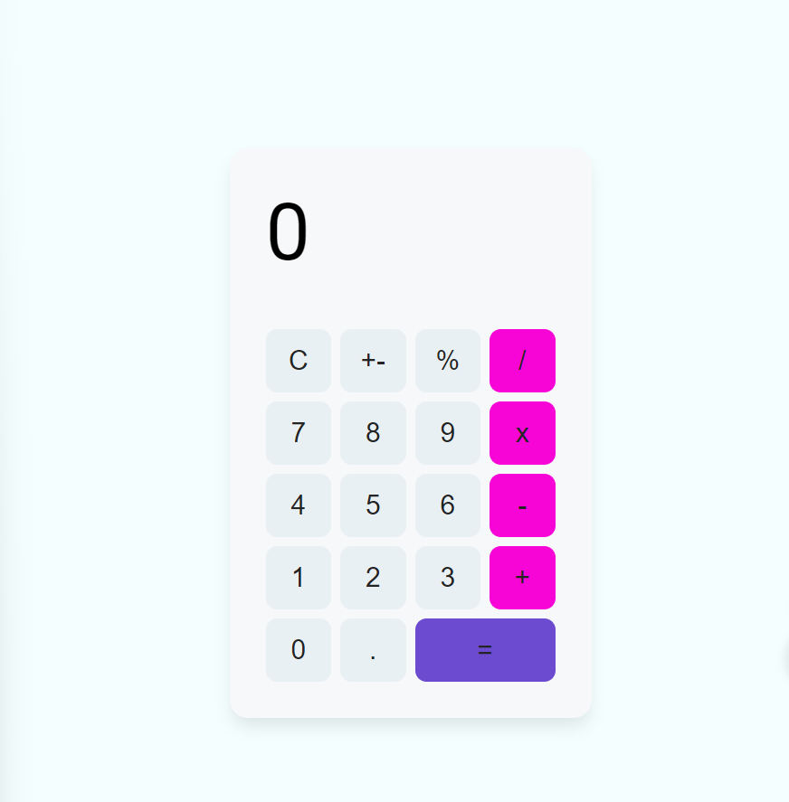

# Calculator App

This is a simple calculator application built with React. It allows users to perform basic arithmetic operations such as addition, subtraction, multiplication, and division. The app features a clean and user-friendly interface with responsive design.



## Table of Contents

- [Features](#features)
- [Usage](#usage)
- [Installation](#installation)
- [Dependencies](#dependencies)
- [Contributing](#contribution)

## Features

- Addition, subtraction, multiplication, and division operations
- Percentage and negation functionalities
- Responsive design for various screen sizes
- Clear button to reset the calculator
- Dynamic button styling on hover
- Visual feedback for the equals button

## Usage

1. Open the [Calculator App](#) in your web browser.
2. Perform arithmetic operations using the on-screen buttons.
3. Use the clear button (C) to reset the calculator.
4. Enjoy a user-friendly and responsive calculator interface.

## Installation

1. Clone the repository to your local machine.

   ```bash
   git clone https://github.com/raza-altaf/calci.git
   ```

2. Change into the project directory.

   ```bash
   cd calculator-app
   ```

3. Install dependencies.

   ```bash
   npm install
   ```

4. Start the development server.

   ```bash
   npm start
   ```

5. Open the app in your web browser at [http://localhost:3000](http://localhost:3000).

## Dependencies

- React: [https://reactjs.org/](https://reactjs.org/)
- React Textfit: [https://github.com/malte-wessel/react-textfit](https://github.com/malte-wessel/react-textfit)

## Contribution

Contributions are welcome! If you find a bug or have an idea for an improvement, feel free to open an issue or submit a pull request.
